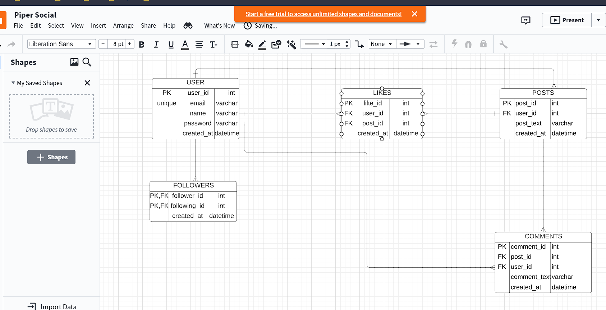

# Hosted Here
https://pipersocial.netlify.app/
## PROJECT FLOW

1.Designed Database Schema using lucid chart

2.Created tables and relationships + participation constraints with SQL as a Relational Database

3.Authentication using JWT TOKEN  

5.VALIDATIONS + ALL STATUS CODE

6.Multer for parsing multiform data

7.Storage AWS S3 Buckets for storing images 

# REST API

8.users indicates existing users of the PiperSocial    

       [x] GET all users of the application                GET       http:://api/users

    ## [x] POSTS API

        [x] Authorization Header

        [x] get a list of current user's posts             GET      http:://api/me/posts

        [x] get a particular post                          GET      http:://api/posts/{post_id}

        [x] get all my friends posts                       GET      http:://api/me/posts/follow

        [x] create a post                                  POST     http:://api/me/posts

        [x] delete a post                                  DELETE   http:://api/me/posts/{post_id}

        [x] get a list of user's posts                     GET      http:://api/users/{user_id}/posts

    ## [x] COMMENT API

        [x] get all comments on a post                     GET      http:://api/posts/{post_id}/comments

        [x] create a comment on a post                     POST     http:://api/me/posts/{post_id}/comments

        [x] delete a comment of a post                     DELETE   http:://api/me/comments/{comment_id}

    ## [x] LIKES API

        [x] like  a post                                   PUT      http:://api/me/posts/{post_id}/likes

        [x] unlike a post                                  DELETE   http:://api/me/posts/{posts_id}/likes

        [x] Liking users(users who have liked the post)    GET      http:://api/posts/{post_id}/likes

    ## [x] FOLLOW API

        [x] follow a user                                  PUT      http:://api/me/users/{user_id}/follow

        [x] unfollow a user                                DELETE   http:://api/me/users/{user_id}/follow

        [x] get all users I follow                         GET      http:://api/me/users/follow

